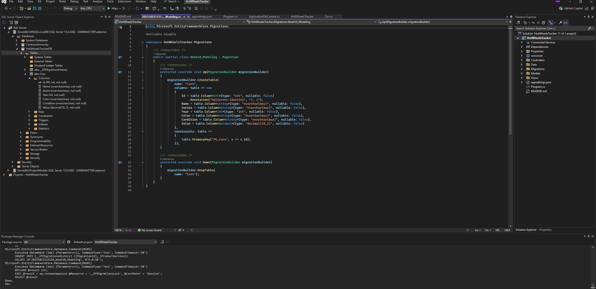
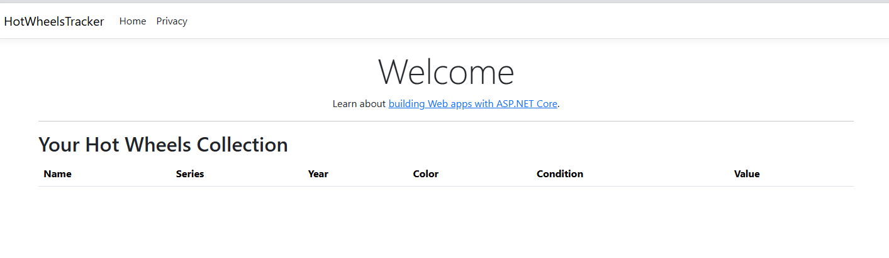
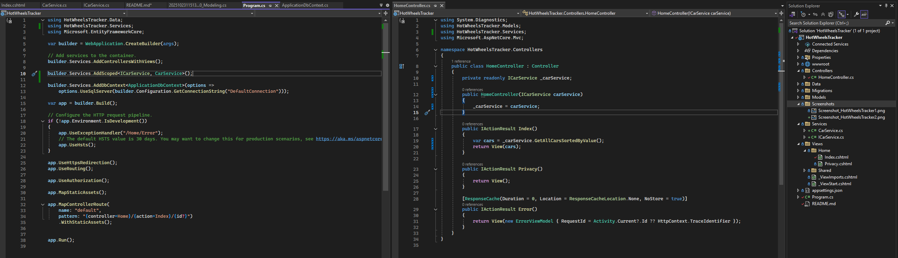
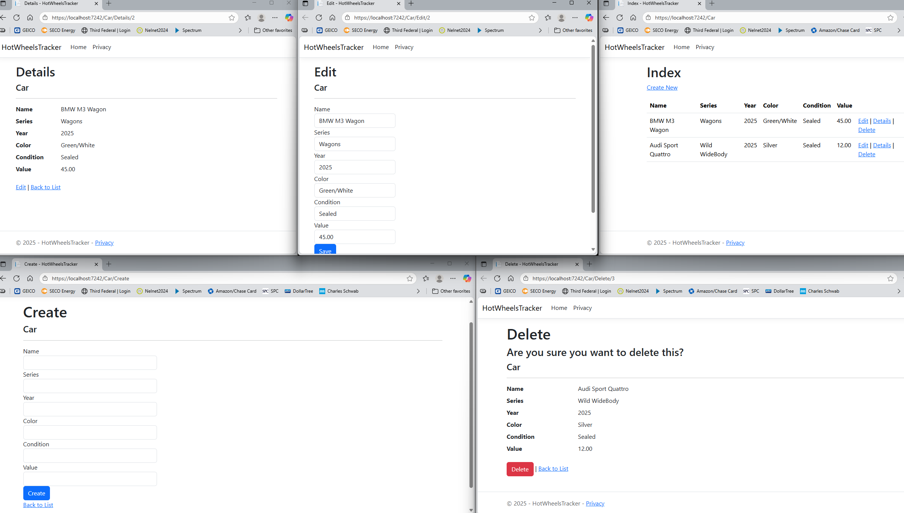
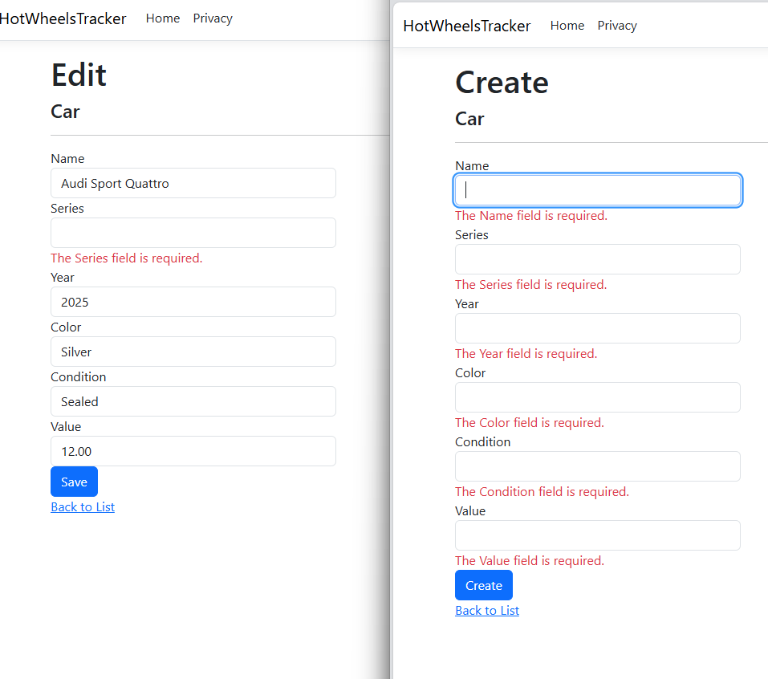
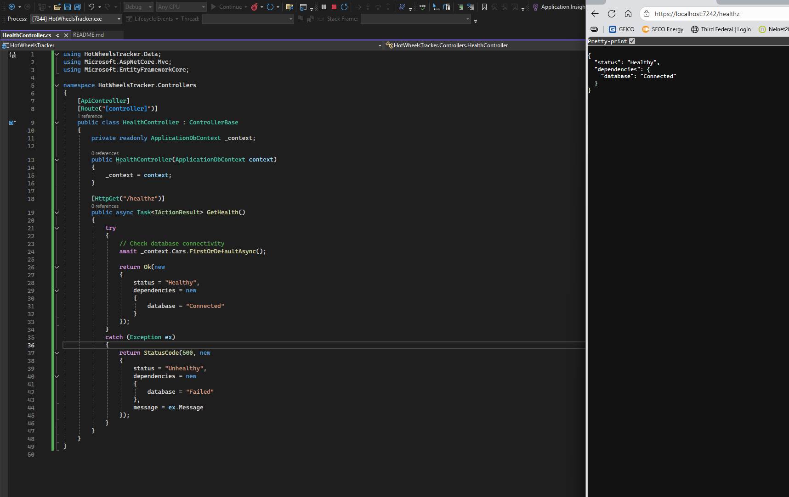
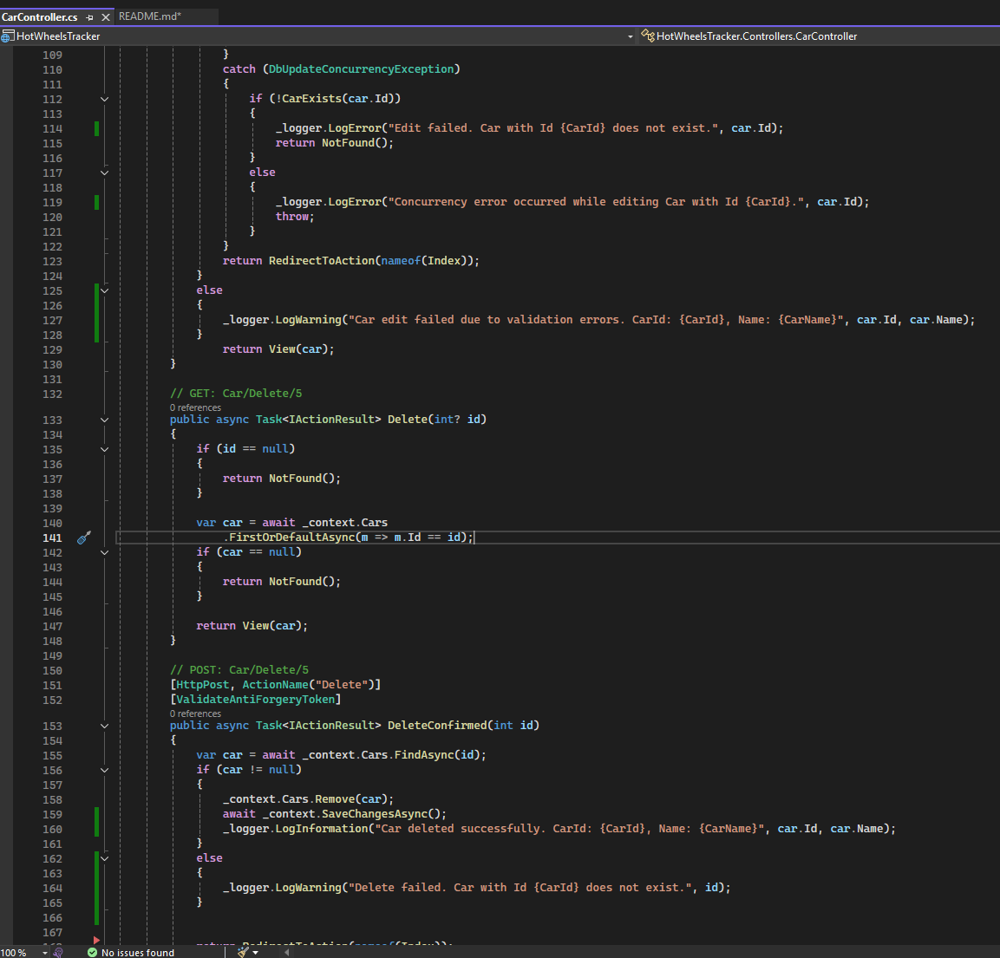
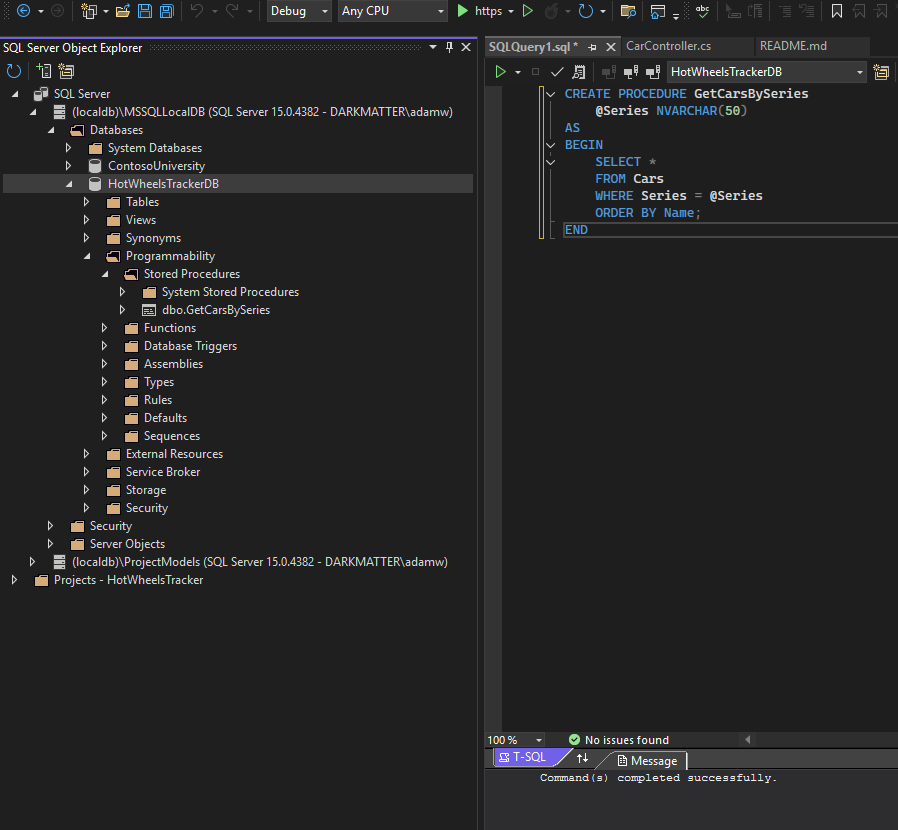
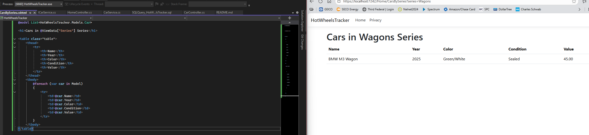

# HotWheelsTracker

ASP.NET Core MVC web app that helps collectors manage and organize their Hot Wheels collection. Users can add, edit, and delete cars, track details like year, color, and value, and view top collectibles.

---

## Week 10 – Modeling

Implemented the Modeling feature for the HotWheelsTracker project. The main goal was to define a data model that represents Hot Wheels cars in the database and prepare it for future features like CRUD operations and service-based logic. I created a `Car` entity class with the following properties: `Id`, `Name`, `Series`, `Year`, `Color`, `Condition`, and `Value`. These properties capture the essential information that a collector would want to track for each car.

Next, I created an `ApplicationDbContext` class, inheriting from `DbContext`, and added a `DbSet<Car>` to represent the Cars table in the database. I configured the DbContext in `Program.cs` and connected it to a SQL Server LocalDB database via a connection string.

After setting up the model and DbContext, I installed the necessary EF Core packages, including `Microsoft.EntityFrameworkCore.SqlServer` and `Microsoft.EntityFrameworkCore.Tools`, to enable migrations. I then created my first migration with the command `Add-Migration Week10_Modeling` and applied it to the database using `Update-Database`. This created the `Cars` table with all defined columns.

To verify the setup, I checked **SQL Server Object Explorer** in Visual Studio and confirmed that the `Cars` table exists with the correct schema. I also built and ran the project to ensure there were no errors, confirming that the database connection and model configuration are working correctly.

---

### Evidence / Screenshots

- **Cars table in SQL Server Object Explorer** & **Migrations folder**  
  

---

## Week 11 - Separation of Concerns / Dependency Injection

I implemented the Separation of Concerns and Dependency Injection feature in the HotWheelsTracker project. The main goal was to move all non-UI logic out of the controller and into a dedicated service, making the controller thinner and easier to maintain.

I created a new folder called Services and added an ICarService interface along with a CarService class. The service handles retrieving cars from the database and sorting them by value. 
This keeps the controller focused solely on coordinating between the view and the service, which aligns with the Separation of Concerns principle.

In `Program.cs`, I registered the service with the dependency injection container using `builder.Services.AddScoped<ICarService`, `CarService>();`. This ensures that whenever a controller requests `ICarService`, the DI container provides an instance of `CarService`. 
In the `HomeController`, I removed the previous logger constructor and replaced it with a constructor that accepts `ICarService`. The controller now calls the service to get the list of cars and passes them to the Index view.
The result is visible on the homepage, where the cars table loads correctly, confirming that DI is working and the controller remains focused on routing and presentation. This approach not only makes the code cleaner and easier to maintain but also allows future features (like filtering or sorting) to be implemented entirely in the service without modifying the controller.

### Evidence / Screenshots

- **Homepage showing cars loaded via CarService (DI working)**  
  

- **Program.cs DI registration and HomeController constructor using ICarService**  
  
---

## Week 12 – CRUD (Create, Read, Update, Delete)

Implemented CRUD functionality for the HotWheelsTracker project, The main goal was to allow users to create, view, edit, and delete Hot Wheels cars while ensuring data integrity and providing validation feedback.
I updated the `CarController` with async data access methods, including `ToListAsync()`, `FindAsync()`, and `SaveChangesAsync()`. These ensure that database operations do not block the main thread and improve application responsiveness. I also used model validation attributes in the `Car` class, such as `[Required]`, `[StringLength]`, and `[Range]`, to provide automatic validation feedback on the Create and Edit forms.
The views for `Index`, `Details`, `Create`, `Edit`, and `Delete` were scaffolded using Entity Framework Core. This allowed the forms and tables to automatically bind to the `Car` model and the `ApplicationDbContext`, streamlining the connection between the database and the UI.
The result is fully functional CRUD operations:
- Users can **add new cars** using the Create form, with validation messages displayed for missing or incorrect data.
- The **Index page** lists all cars currently in the database.
- Users can view **Details** of each car, edit existing records, and delete cars with confirmation prompts.
- All operations interact asynchronously with the database to maintain performance and scalability.

### Evidence / Screenshots

- **CRUD pages**
  
- **Validation messages on Create/Edit forms**
  

---
## Week 13 - Diagnostics

I implemented the Diagnostics feature for the HotWheelsTracker project by adding a `/healthz` endpoint. I was able to add a simple health check that confirms the application and its dependencies are functioning correctly. This endpoint helps developers and system administrators quickly verify the app's status and troubleshoot issues without exposing sensitive information.

To implement this, I created a `HealthController` with a `Get` action that returns JSON containing the overall status and checks at least one real dependency, the database connection. Using asynchronous calls, the controller attempts to query the database to ensure it is reachable. 
If the database is accessible, the endpoint returns a `"Healthy"` status; if there is an issue, it returns a `"Degraded"` or `"Unhealthy"` status along with a short message describing the problem. This ensures enough detail is provided for troubleshooting while keeping sensitive connection details hidden.
Testing the `/healthz` endpoint confirmed that the application correctly reports its health. The JSON output includes the status and dependency checks, making it easy to identify if the database or other critical services are unavailable. 
This approach mirrors real-world diagnostics used in production applications, supporting monitoring tools and automated alerting.

### Evidence / Screenshots

- **Health Controller & /healthz endpoint output**

---
## Week 14 - Logging

Implemented structured logging in the HotWheelsTracker project. I capture both success and error paths for key actions in the CarController to make the application easier to monitor and troubleshoot.
I added logging to Create, Edit, and Delete actions. For the Create action, successful car creation logs the CarId and Name, while validation failures log a warning including the attempted Car Name. In the Edit action, successful edits remain unlogged, but validation failures now log warnings, and concurrency errors log detailed error messages including the CarId. 
For Delete, both successful deletion and attempts to delete a non-existent car are logged, providing clear feedback on the operation outcome.
These logs use structured fields to ensure that key information, such as CarId, Name, and the type of action, is captured consistently. This approach makes it easier to trace issues and monitor application behavior without exposing sensitive data. All logs are routed through ASP.NET Core’s built-in logging infrastructure, which can be configured to output to the console, files, or external logging services as needed.
This feature ensures that important events in the application are recorded, improving maintainability, troubleshooting, and observability. For example, if a user reports a problem with editing a car, the logs provide detailed context on the attempted operation and whether it failed due to validation, concurrency, or a missing record.

### Evidence / Screenshots
- **Logging in CarController actions**
  

---

## Week 15 – Stored Procedures
I implemented the Stored Procedures feature in the HotWheelsTracker project. I execute a SQL stored procedure from the application and render its results in a view. This demonstrates how EF Core can interact with database-side logic while keeping the app clean and maintainable.
I started by creating a stored procedure in SQL Server named `GetCarsBySeries`, which accepts a `series` parameter and returns all cars from that series:
```sql
CREATE PROCEDURE GetCarsBySeries
    @series NVARCHAR(50)
AS
BEGIN
    SELECT * FROM Cars
    WHERE Series = @series
    ORDER BY Value DESC;
END
```

Next, I updated the ICarService interface and CarService class to include a method GetCarsBySeriesAsync, which safely calls this stored procedure using EF Core’s FromSqlInterpolated:
```
public async Task<List<Car>> GetCarsBySeriesAsync(string series)
{
    return await _context.Cars
        .FromSqlInterpolated($"EXEC GetCarsBySeries {series}")
        .ToListAsync();
}
```

In HomeController, I added an action CarsBySeries that takes a series as input, calls the service method, and passes the results to the corresponding view. The view iterates over the returned cars and displays their details in a table.
This implementation shows a stored procedure via EF Core, handling parameters safely, and rendering the results in the UI. It also provides a clear demonstration of end-to-end data flow.

### Evidence / Screenshots

- **Stored Procedure in SQL Server**  
  
- **Cars in series view with code**
  

---


